# AgroTech AI - Agricultural Monitoring System

An intelligent agricultural monitoring system powered by AI agents that analyze crop images, soil health, and environmental factors in real-time. The system uses multiple specialized AI agents to provide comprehensive agricultural insights and automated decision-making through image analysis.

## 🧪 **Proof of Concept**

> **Note:** This project is a **proof of concept** demonstrating multi-agent AI systems for agricultural monitoring. It was developed using **vibecoding** - an iterative, AI-assisted development approach that emphasizes rapid prototyping and continuous refinement.

### **Vibecoding Development Process**
- **AI-Assisted Architecture**: System design and implementation guided by AI collaboration
- **Rapid Iteration**: Quick prototyping with immediate testing and refinement
- **Continuous Enhancement**: Features evolved through iterative development cycles
- **Real-time Problem Solving**: Issues addressed as they emerged during development

### **Educational Purpose**
This proof of concept serves as:
- 📚 **Learning Tool**: Demonstrates modern AI agent architectures
- 🔬 **Research Platform**: Explores multi-agent coordination in agricultural contexts
- 💡 **Innovation Showcase**: Illustrates possibilities of AI-driven agricultural analysis
- 🚀 **Foundation**: Base for future agricultural AI development

*Built with curiosity, refined through collaboration, powered by AI innovation.*

---

## 🌟 Features

- **Multi-Agent AI System**: Four specialized AI agents working together
  - **ImageVision**: Advanced image analysis of uploaded agricultural photos
  - **AgriVision**: Visual analysis of crop health and pest detection
  - **SoilSense**: Environmental conditions and soil analysis  
  - **CropMaster**: Integrated decision-making and recommendations
- **Image Upload & Analysis**: Drag-and-drop image upload with real-time AI analysis
- **Real-time Monitoring**: Live data processing and WebSocket communication
- **Interactive Dashboard**: React-based frontend with real-time visualizations
- **Docker Support**: Containerized deployment with docker-compose
- **Advanced Logging**: Comprehensive logging system for monitoring and debugging

## 🏗️ Architecture

This project follows a client-server architecture with multi-agent AI coordination:

```
AgroTech AI/
├── client/              # React frontend application
│   ├── app.jsx          # Main React component with agent coordination
│   ├── ScenarioForm.jsx # Image upload and environment input form
│   ├── ImageUpload.jsx  # Drag-and-drop image upload component
│   ├── main.jsx         # React entry point
│   ├── index.html       # HTML template
│   ├── styles.css       # Tailwind CSS styles
│   └── package.json     # Frontend dependencies
├── server/              # FastAPI backend application
│   ├── main.py          # FastAPI server with WebSocket support
│   ├── agents.py        # AI agents implementation
│   ├── websocket_handler.py # WebSocket communication handler
│   ├── requirements.txt # Python dependencies
│   └── Dockerfile       # Docker container configuration
└── docker-compose.yml   # Multi-service Docker orchestration
```

### 🔄 Client-WebSocket-Agent Workflow

The following diagram illustrates the real-time communication flow between the React client, WebSocket server, and AI agents:

```mermaid
sequenceDiagram
    participant C as React Client
    participant WS as WebSocket Handler
    participant IV as ImageVision Agent
    participant AV as AgriVision Agent
    participant SS as SoilSense Agent
    participant CM as CropMaster Agent
    participant O as Ollama LLM

    Note over C: User uploads image + environment data
    C->>WS: WebSocket: image_analysis event
    Note over WS: {type: "image_analysis", image_data: "base64...", environment_description: "..."}
    
    WS->>C: Status: "📸 ImageVision procesando imagen..."
    
    %% ImageVision Analysis Phase
    WS->>IV: analyze_image(base64_image)
    IV->>IV: _optimize_image() - Resize, compress, convert to JPEG
    IV->>O: POST /api/generate (with optimized image)
    Note over O: Vision Model: qwen2.5vl:3b
    O-->>IV: JSON response with image analysis
    IV-->>WS: Detailed image description + visual indicators
    WS->>C: Agent Result: ImageVision data
    
    %% Parallel Analysis Phase  
    WS->>C: Status: "🔍🌍 Analizando salud del cultivo y condiciones ambientales..."
    
    par AgriVision Analysis
        WS->>AV: analyze_image(image_description)
        AV->>O: POST /api/generate (text prompt)
        Note over O: Text Model: gemma3:4b
        O-->>AV: Crop health assessment JSON
        AV-->>WS: Crop analysis results
    and SoilSense Analysis  
        WS->>SS: analyze_environment(combined_environment)
        SS->>O: POST /api/generate (text prompt)
        Note over O: Text Model: gemma3:4b  
        O-->>SS: Soil/environment analysis JSON
        SS-->>WS: Environmental results
    end
    
    WS->>C: Agent Result: AgriVision data
    WS->>C: Agent Result: SoilSense data
    
    %% Final Decision Phase
    WS->>C: Status: "🧠 CropMaster fusionando datos y decidiendo..."
    WS->>CM: make_decision(vision_data, soil_data)
    CM->>O: POST /api/generate (integrated analysis prompt)
    Note over O: Text Model: gemma3:4b
    O-->>CM: Final recommendations JSON
    CM-->>WS: Integrated decision
    WS->>C: Agent Result: CropMaster data
    
    WS->>C: Status: "✅ Análisis completado"
    
    Note over C: Client displays results in real-time dashboard
```



### 🔧 WebSocket Communication Protocol

**Client → Server Events:**
- `ping` - Heartbeat to maintain connection
- `image_analysis` - Trigger AI analysis with image data
- `custom_scenario` - Analyze text-based scenarios

**Server → Client Events:**
- `pong` - Heartbeat response
- `agent_result` - Results from individual AI agents
- `status` - Progress updates during analysis
- `error` - Error messages and diagnostics

**Agent Processing Pipeline:**
1. **ImageVision** - Visual analysis and image optimization
2. **AgriVision & SoilSense** - Parallel crop and environmental analysis  
3. **CropMaster** - Integrated decision-making and recommendations

## 🚀 Getting Started

### Prerequisites

- **Node.js** v20.18.3 or higher
- **Python** 3.8 or higher
- **Ollama** (AI model server)
- **Docker** and **Docker Compose** (for containerized deployment)

## 🐳 Quick Start with Docker (Recommended)

The easiest way to run the entire system is using Docker Compose:

1. **Clone the repository**:
   ```bash
   git clone <repository-url>
   cd reto2
   ```

2. **Start all services**:
   ```bash
   docker-compose up
   ```

   This will automatically:
   - Build and start the FastAPI server
   - Start the React client with hot reload
   - Download and run Ollama with the required model
   - Set up networking between all services

3. **Access the application**:
   - Frontend: http://localhost:3000
   - Backend API: http://localhost:8000
   - Ollama API: http://localhost:11434

## 🔧 Manual Installation

### 🤖 Ollama Setup

Ollama is a local AI model server that runs large language models on your machine. It provides the AI capabilities for our agricultural agents.

1. **Install Ollama**:
   ```bash
   # On macOS
   brew install ollama
   
   # On Linux
   curl -fsSL https://ollama.ai/install.sh | sh
   
   # On Windows
   # Download from https://ollama.ai/download
   ```

2. **Start Ollama server**:
   ```bash
   ollama serve
   ```

3. **Install the required model**:
   ```bash
   ollama pull gemma3:4b
   ```

   > **Note**: The system is configured to use the `gemma3:4b` model for better performance and image analysis capabilities. You can also use other models by updating the `MODEL_NAME` variable in `server/agents.py`.

### 🔧 Installation

1. **Clone the repository**:
   ```bash
   git clone <repository-url>
   cd reto2
   ```

2. **Install server dependencies**:
   ```bash
   cd server
   pip install -r requirements.txt
   ```

3. **Install client dependencies**:
   ```bash
   cd ../client
   npm install
   ```

### 🏃‍♂️ Running the Application

#### Start the Backend Server

1. **Navigate to server directory**:
   ```bash
   cd server
   ```

2. **Start the FastAPI server**:
   ```bash
   uvicorn main:app --host 0.0.0.0 --port 8000 --reload
   ```

   The server will be available at: `http://localhost:8000`

#### Start the Frontend Client

1. **Navigate to client directory**:
   ```bash
   cd client
   ```

2. **Start the React development server**:
   ```bash
   npm start
   ```

   The client will be available at: `http://localhost:3000`

### 🔍 API Endpoints

- **GET** `/` - Health check and API information
- **GET** `/health` - Server and Ollama status check
- **WebSocket** `/ws` - Real-time communication for AI agent data

## 🧠 AI Agents Overview

### ImageVision Agent
- **Purpose**: Advanced image analysis of agricultural photos
- **Capabilities**: 
  - Real-time image processing and optimization
  - Detailed visual crop description generation
  - Soil condition assessment from visual cues
  - Plant health indicator identification
  - Environmental context analysis from images

### AgriVision Agent
- **Purpose**: Visual analysis of crop conditions based on image descriptions
- **Capabilities**: 
  - Crop health assessment
  - Pest and disease detection
  - Leaf condition analysis
  - Visual symptom identification

### SoilSense Agent
- **Purpose**: Environmental and soil monitoring
- **Capabilities**:
  - Soil moisture analysis
  - pH level monitoring
  - Temperature and humidity tracking
  - Irrigation recommendations

### CropMaster Agent
- **Purpose**: Integrated decision-making
- **Capabilities**:
  - Data fusion from multiple agents
  - Risk assessment
  - Yield estimation
  - Priority action recommendations

## 📊 Image Analysis Workflow

The system now features an advanced image analysis workflow:

1. **📸 Image Upload**: Drag-and-drop interface for agricultural photos
2. **🔍 Image Processing**: Automatic optimization and base64 encoding
3. **🤖 AI Analysis**: Multi-agent analysis pipeline:
   - ImageVision extracts detailed visual descriptions
   - AgriVision analyzes crop health from descriptions
   - SoilSense evaluates environmental conditions
   - CropMaster provides integrated recommendations

## 📊 Pre-configured Environmental Conditions

The system includes four pre-configured environmental scenarios:

1. **🌱 Ideal Conditions**: Optimal growing environment
2. **🐛 High Humidity**: Conditions favorable for pest development
3. **💧 Dry Conditions**: Drought stress monitoring
4. **🧪 High pH**: Alkaline soil conditions

## 🛠️ Technology Stack

### Backend
- **FastAPI**: Modern Python web framework
- **Uvicorn**: ASGI server
- **WebSockets**: Real-time communication
- **Requests**: HTTP client for Ollama integration
- **Ollama**: Local AI model server (gemma3:4b)
- **PIL (Pillow)**: Image processing and optimization
- **asyncio**: Asynchronous processing for better performance

### Frontend
- **React 18**: User interface framework
- **Vite**: Build tool and development server
- **Tailwind CSS**: Utility-first CSS framework
- **Chart.js**: Data visualization
- **Native WebSocket API**: Real-time communication

### DevOps
- **Docker**: Containerization platform
- **Docker Compose**: Multi-service orchestration
- **Ollama Container**: Containerized AI model serving

## 🔧 Development

### Server Development
```bash
cd server
# Install dependencies
pip install -r requirements.txt

# Run with auto-reload
uvicorn main:app --reload
```

### Client Development
```bash
cd client
# Install dependencies
npm install

# Start development server
npm start

# Build for production
npm run build
```

## 🧪 Testing the System

### With Docker (Recommended)
1. **Start with Docker Compose**: `docker-compose up`
2. **Open your browser** to `http://localhost:3000`
3. **Upload an agricultural image** using the drag-and-drop interface
4. **Select environmental conditions** or use predefined scenarios
5. **Watch real-time AI analysis** from all four agents

### Manual Setup
1. **Ensure Ollama is running** with the gemma3:4b model
2. **Start the backend server** on port 8000
3. **Start the frontend client** on port 3000
4. **Open your browser** to `http://localhost:3000`
5. **Upload images and analyze** agricultural conditions in real-time

### Sample Workflow
1. **Drag and drop** an agricultural image (JPG, PNG, WebP)
2. **Choose environmental conditions** from presets or custom input
3. **Click "Analyze Image"** to start the AI analysis
4. **Monitor progress** as each agent processes the data:
   - ImageVision analyzes the uploaded image
   - AgriVision evaluates crop health
   - SoilSense assesses environmental factors
   - CropMaster provides final recommendations

## 📝 Configuration

### Model Configuration
To change the AI model, edit `server/agents.py`:
```python
MODEL_NAME = "gemma3:4b"  # Change to other Ollama models
VISION_MODEL_NAME = "qwen2.5vl:3b"  # Model for image analysis
```

### 🎛️ **Ollama Model Parameters**

Fine-tune AI agent behavior by adjusting Ollama model parameters in `server/agents.py`. These parameters control response quality, creativity, and processing characteristics.

#### **Core Parameters**

```python
# In OllamaAgent.generate_response() and ImageVisionAgent.analyze_image()
"options": {
    "temperature": 0.7,      # Creativity vs consistency (0.0-1.0)
    "top_p": 0.9,           # Nucleus sampling threshold (0.0-1.0)
    "num_predict": 300,     # Maximum tokens in response
    "num_ctx": 4096,        # Context window size
    "num_batch": 512,       # Processing batch size
    "num_gpu": -1,          # GPU layers (-1 = auto)
    "low_vram": False       # Memory optimization
}
```

#### **Parameter Explanations**

**🌡️ Temperature (0.0 - 1.0)**
- **0.1-0.3**: Very focused, consistent responses (ideal for technical analysis)
- **0.7**: Balanced creativity and consistency (current default)
- **0.9-1.0**: More creative, varied responses (still coherent)

```python
# Conservative agricultural analysis
"temperature": 0.3

# Creative crop recommendations  
"temperature": 0.9
```

**🎯 Top-p (0.0 - 1.0)**
- **0.5**: Very focused vocabulary (safe, predictable)
- **0.9**: Balanced vocabulary selection (current default)
- **0.95-1.0**: Full vocabulary access (more diverse)

```python
# Precise technical terms only
"top_p": 0.7

# Rich agricultural vocabulary
"top_p": 0.95
```

**📝 num_predict (50 - 2048)**
- **100-200**: Brief, concise responses
- **300**: Detailed analysis (current default)
- **500+**: Comprehensive, verbose responses

```python
# Quick assessments
"num_predict": 150

# Detailed agricultural reports
"num_predict": 500
```

**🧠 num_ctx (1024 - 32768)**
- **2048**: Basic context retention
- **4096**: Good context for complex analysis (current default)
- **8192+**: Extended context for complex scenarios

```python
# Simple image analysis
"num_ctx": 2048

# Complex multi-factor analysis
"num_ctx": 8192
```

#### **Performance Parameters**

**⚡ num_batch (128 - 1024)**
- **256**: Conservative processing
- **512**: Balanced performance (current default)
- **1024**: High throughput (requires more memory)

**🎮 num_gpu (-1, 0, or specific number)**
- **-1**: Auto-detect and use all available GPU layers
- **0**: CPU-only processing
- **20**: Use specific number of GPU layers

**💾 low_vram (true/false)**
- **false**: Normal memory usage (current default)
- **true**: Optimized for systems with limited VRAM

#### **Use Case Examples**

**🔬 Scientific Analysis (High Precision)**
```python
"options": {
    "temperature": 0.2,
    "top_p": 0.8,
    "num_predict": 400,
    "num_ctx": 8192
}
```

**🌱 General Farming Advice (Balanced)**
```python
"options": {
    "temperature": 0.7,
    "top_p": 0.9,
    "num_predict": 300,
    "num_ctx": 4096
}
```

**🚀 Creative Recommendations (High Creativity)**
```python
"options": {
    "temperature": 1.0,
    "top_p": 0.95,
    "num_predict": 500,
    "num_ctx": 4096
}
```

**💨 Fast Processing (Speed Optimized)**
```python
"options": {
    "temperature": 0.5,
    "top_p": 0.8,
    "num_predict": 200,
    "num_ctx": 2048,
    "num_batch": 256
}
```

#### **Customization Locations**

**General Agents** (`server/agents.py` line ~75):
```python
"options": {
    "temperature": 0.7,    # Modify this
    "top_p": 0.9,         # And this
    "num_predict": 300    # And this
}
```

**Vision Agent** (`server/agents.py` line ~220):
```python
"options": {
    "temperature": 0.3,    # Lower for precise image analysis
    "num_predict": 300,    # Reduced from 400
    "num_ctx": 4096,      # Context window
    "low_vram": False     # Set to True if running out of VRAM
}
```

#### **Performance Impact**
- **Higher temperature/top_p**: More creative but potentially slower
- **Larger num_ctx**: Better context but more memory usage
- **Higher num_predict**: Longer responses but slower processing
- **Larger num_batch**: Faster throughput but more memory usage

#### **Monitoring Results**
Check parameter effectiveness:
```bash
# Monitor response times
docker compose logs api-server | grep "completed in"

# Monitor memory usage
docker stats

# Test different configurations
curl -X POST http://localhost:11434/api/generate -d '{
  "model": "gemma3:4b",
  "prompt": "Test prompt",
  "options": {"temperature": 0.3, "top_p": 0.8}
}'
```

### ⚡ Hardware Optimization

Optimize OLLAMA performance based on your machine specifications. Update these environment variables in `docker-compose.yml`:

#### **CPU Configuration**
Check your CPU specs with: `lscpu | grep -E "^CPU\(s\)|^Core\(s\)|^Thread\(s\)"`

```yaml
# Example: 8 cores, 16 threads system
environment:
  - OLLAMA_NUM_THREADS=8        # Match your physical CPU cores
  - OLLAMA_NUM_PARALLEL=6       # 75% of cores for parallel requests
  - OMP_NUM_THREADS=6           # OpenMP threads (same as NUM_PARALLEL)
  - GOMAXPROCS=6                # Go runtime threads
```

**Guidelines:**
- **OLLAMA_NUM_THREADS**: Set to your physical CPU cores (not threads)
- **OLLAMA_NUM_PARALLEL**: 75% of CPU cores (leave some for system)
- **OMP_NUM_THREADS**: Same as NUM_PARALLEL for optimal performance
- **GOMAXPROCS**: Match NUM_PARALLEL

#### **Memory Configuration**
Check available RAM with: `free -h`

```yaml
# Adjust container memory limits in docker-compose.yml
deploy:
  resources:
    limits:
      memory: 24G    # 60-80% of total RAM for Ollama
    reservations:
      memory: 16G    # Guaranteed minimum
```

**Memory Guidelines:**
- **Small models (3-7B)**: 4-8GB RAM
- **Medium models (7-13B)**: 8-16GB RAM  
- **Large models (13B+)**: 16-32GB RAM

#### **GPU Configuration (Optional)**
For NVIDIA GPUs, update docker-compose.yml:

```yaml
# Replace ROCm configuration with NVIDIA
image: ollama/ollama:latest  # Use standard image for NVIDIA
runtime: nvidia
environment:
  - NVIDIA_VISIBLE_DEVICES=all
  - OLLAMA_GPU_OVERHEAD=2048   # GPU memory buffer (MB)
```

For integrated GPUs or CPU-only:
```yaml
environment:
  - OLLAMA_GPU_OVERHEAD=0      # No GPU acceleration
```

#### **Performance Tuning Examples**

**High-Performance Desktop (16+ cores, 32GB+ RAM):**
```yaml
environment:
  - OLLAMA_NUM_THREADS=12
  - OLLAMA_NUM_PARALLEL=10
  - OMP_NUM_THREADS=10
  - GOMAXPROCS=10
  - OLLAMA_MAX_LOADED_MODELS=3
deploy:
  resources:
    limits:
      memory: 28G
      cpus: '14.0'
```

**Mid-Range System (8 cores, 16GB RAM):**
```yaml
environment:
  - OLLAMA_NUM_THREADS=8
  - OLLAMA_NUM_PARALLEL=6
  - OMP_NUM_THREADS=6
  - GOMAXPROCS=6
  - OLLAMA_MAX_LOADED_MODELS=2
deploy:
  resources:
    limits:
      memory: 12G
      cpus: '6.0'
```

**Budget System (4 cores, 8GB RAM):**
```yaml
environment:
  - OLLAMA_NUM_THREADS=4
  - OLLAMA_NUM_PARALLEL=3
  - OMP_NUM_THREADS=3
  - GOMAXPROCS=3
  - OLLAMA_MAX_LOADED_MODELS=1
deploy:
  resources:
    limits:
      memory: 6G
      cpus: '3.5'
```

#### **Custom OLLAMA URL**
To use external OLLAMA instance:
```bash
# Set environment variable
export OLLAMA_URL=http://your-ollama-server:11434

# Or in docker-compose.yml for api-server:
environment:
  - OLLAMA_URL=http://external-ollama:11434
```

#### **Monitoring Performance**
Check if your settings are working:
```bash
# Monitor resource usage
docker stats

# Check Ollama logs
docker compose logs ollama

# Test API response time
curl -w "@curl-format.txt" http://localhost:11434/api/tags
```

### Port Configuration
- **Backend**: Change port in uvicorn command or `main.py`
- **Frontend**: Change port in `vite.config.js`

## 🚨 Troubleshooting

### Common Issues

1. **"Could not connect to Ollama"**:
   - Ensure Ollama is running: `ollama serve`
   - Check if the model is installed: `ollama list`
   - For Docker: Check if ollama service is healthy

2. **"Error loading ASGI app"**:
   - Run uvicorn from the server directory
   - Use: `uvicorn main:app --reload`
   - Check if all Python dependencies are installed

3. **Frontend connection issues**:
   - Ensure backend is running on port 8000
   - Check WebSocket connection in browser console
   - Verify network connectivity between containers (if using Docker)

4. **Image upload problems**:
   - Check file size (large images are automatically optimized)
   - Supported formats: JPG, PNG, WebP
   - Clear browser cache if upload interface doesn't respond

5. **AI analysis failures**:
   - Check Ollama model availability: `ollama list`
   - Monitor server logs for detailed error messages
   - Ensure sufficient system resources (RAM/GPU) for model inference

### Port Conflicts
- Backend default: `8000`
- Frontend default: `3000`
- Ollama default: `11434`

## 🔍 API Reference

### WebSocket Events

The system uses WebSocket communication for real-time AI agent interaction:

#### Client → Server Events
```javascript
// Image analysis request
{
  "type": "image_analysis",
  "image_data": "base64_encoded_image",
  "environment_description": "Environmental conditions text"
}
```

#### Server → Client Events
```javascript
// Agent result
{
  "type": "agent_result",
  "agent": "ImageVision|AgriVision|SoilSense|CropMaster",
  "data": {
    // Agent-specific response data
  }
}

// Status update
{
  "type": "status",
  "message": "Analysis status message"
}
```

### REST Endpoints
- **GET** `/` - API information and health check
- **GET** `/health` - Detailed system health including Ollama connectivity
- **WebSocket** `/ws` - Real-time agent communication

### Image Processing
- **Supported formats**: JPG, PNG, WebP
- **Automatic optimization**: Images larger than 1024px are resized
- **Quality optimization**: JPEG compression at 85% quality
- **Base64 encoding**: All images converted for WebSocket transmission

## 📄 License

This project is for educational purposes as part of EAFIT University coursework.

## 🤝 Contributing

This is an academic project. For improvements or suggestions, please create an issue or submit a pull request.

---

**Built with ❤️ for sustainable agriculture and AI innovation**
