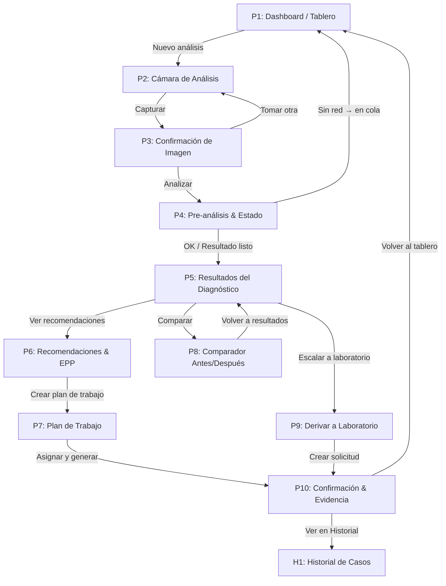

## Diseño CX/UX: Flujos de Aplicación (Wireframing)

### Fase 1 — Selección del flujo crítico
**Flujo elegido:** **Diagnóstico por imagen**  
**Por qué:** Es el camino de mayor valor y frecuencia en campo. Reduce incertidumbre, activa acciones (aplicar/esperar), y alimenta trazabilidad y auditoría. Además, condiciona la arquitectura offline (cámara lite, sincronización diferida) y el semáforo por lote.

---

### **Canvas de Wireflow: Diagnóstico por Imagen**

**Arquetipo Principal:** Mayordomo de Finca (también útil para Técnico y Productor)  
**Job to be Done (JTBD):** “Cuando encuentro una hoja con aspecto enfermo, quiero obtener un diagnóstico rápido y fiable, para poder tomar acciones antes de que se propague.”  
**Contexto de Uso:** En el cultivo, a pleno sol, una mano ocupada, conectividad intermitente, teléfono de gama media/baja, necesidad de pasos mínimos y botones grandes.

---

#### **P1: Dashboard / Tablero (Semáforo por Lote)**
* **Propósito:** Ofrecer acceso inmediato a “Nuevo análisis” y priorizar lotes con riesgo.
* **Componentes UI Principales:**
  * `Header: “Semáforo por lote” + Icono de sincronización`
  * `Tarjetas de Lote: color (rojo/amarillo/verde), últimas acciones, CTA “Analizar”`
  * `FAB: “Nuevo análisis” (icono cámara)`
  * `Filtro rápido: cultivo / prioridad / zona`
* **Interacciones y Conexiones:**
  * Tap en `FAB “Nuevo análisis”` → **P2: Cámara de Análisis**
  * Tap en `Tarjeta de Lote > Analizar` → **P2: Cámara de Análisis** con lote preseleccionado
* **Anotaciones Clave:** Cargar instantáneo, persistencia offline del estado y cola de sincronización diferida.

---

#### **P2: Cámara de Análisis (Modo Lite)**
* **Propósito:** Capturar una imagen clara y ligera de la hoja/síntoma.
* **Componentes UI Principales:**
  * `Vista de cámara a pantalla completa`
  * `Guía de encuadre (marco + pictograma de hoja)`
  * `Botón Capturar (grande, centrado)`
  * `Flash on/off`, `Cambiar cámara`, `Cancelar`
* **Interacciones y Conexiones:**
  * Tap en `Capturar` → **P3: Confirmación de Imagen**
  * Tap en `Cancelar` → **P1: Dashboard**
* **Anotaciones Clave:** Compresión local y guardado diferido; tips breves (“Evita sombras fuertes”).

---

#### **P3: Confirmación de Imagen**
* **Propósito:** Verificar calidad antes de procesar.
* **Componentes UI Principales:**
  * `Preview de foto`
  * `Botón Principal: “Analizar”`
  * `Botón Secundario: “Tomar otra”`
* **Interacciones y Conexiones:**
  * Tap `Analizar` → **P4: Pre-análisis & Estado**
  * Tap `Tomar otra` → **P2: Cámara de Análisis**
* **Anotaciones Clave:** Si no hay red, mostrar “Analizando en dispositivo / en cola para IA” (fallback local o diferido).

---

#### **P4: Pre-análisis & Estado (Carga/Progreso)**
* **Propósito:** Informar del estado de procesamiento y aplicar reglas rápidas (umbral/ventana climática) si están disponibles localmente.
* **Componentes UI Principales:**
  * `Indicador de progreso (local/IA)`
  * `Ficha de lote/cultivo (si viene de P1)`
  * `Mensajes de estado: “Procesando IA”, “Sin red: en cola”, “Aplicar o esperar (preliminar)”`
* **Interacciones y Conexiones:**
  * Al completar → **P5: Resultados del Diagnóstico**
  * Si sin red → guardar en `Cola` y permitir `Seguir explorando` → **P1**; notificar cuando haya resultado
* **Anotaciones Clave:** Manejar timeouts, reintentos y estrategia de colas.

---

#### **P5: Resultados del Diagnóstico**
* **Propósito:** Presentar el diagnóstico y nivel de confianza de forma simple, con acciones claras.
* **Componentes UI Principales:**
  * `Tarjeta Diagnóstico: nombre probable + confianza`
  * `Etiqueta simple: “Aplicar / Esperar” (según umbral)`
  * `Botón: “Ver recomendaciones”`
  * `Botón: “Comparar (antes/después)”`
  * `Acción: “Escalar a laboratorio” (si baja confianza)`
* **Interacciones y Conexiones:**
  * Tap `Ver recomendaciones` → **P6: Recomendaciones & EPP**
  * Tap `Comparar` → **P8: Comparador Antes/Después**
  * Tap `Escalar a laboratorio` → **P9: Derivar a Laboratorio**
* **Anotaciones Clave:** Lenguaje llano; iconografía de riesgo; accesos rápidos.

---

#### **P6: Recomendaciones & EPP**
* **Propósito:** Describir acciones, dosis/mezcla y EPP mínimo; validar disponibilidad.
* **Componentes UI Principales:**
  * `Lista de recomendaciones (pasos cortos + pictogramas)`
  * `Bloque EPP obligatorio (checklist)`
  * `Disponibilidad básica de insumos/EPP (ligero)`
  * `CTA: “Crear plan de trabajo”`
* **Interacciones y Conexiones:**
  * Tap `Crear plan de trabajo` → **P7: Plan de Trabajo**
* **Anotaciones Clave:** Si falta EPP/insumo, ofrecer alternativas/bloquear ejecución.

---

#### **P7: Plan de Trabajo (Orden de tarea)**
* **Propósito:** Convertir recomendación en orden ejecutable en campo.
* **Componentes UI Principales:**
  * `Resumen: lote, cultivo, diagnóstico`
  * `Campos: cuadrilla, fecha/hora, duración, notas`
  * `CTA Principal: “Asignar y generar orden”`
  * `CTA Secundario: “Guardar borrador offline”`
* **Interacciones y Conexiones:**
  * `Asignar y generar` → **P10: Confirmación & Evidencia**
  * `Guardar borrador` (offline) → vuelve a **P1** con badge de “Pendiente”
* **Anotaciones Clave:** Validar ventana climática; avisar conflictos.

---

#### **P8: Comparador Antes/Después**
* **Propósito:** Mostrar evidencia visual para apoyar decisión/aprendizaje.
* **Componentes UI Principales:**
  * `Slider de comparación`
  * `Galería del lote`
  * `CTA: “Volver a resultados”`
* **Interacciones y Conexiones:**
  * `Volver a resultados` → **P5: Resultados del Diagnóstico**
* **Anotaciones Clave:** Carga local si sin red; compresión de imágenes.

---

#### **P9: Derivar a Laboratorio**
* **Propósito:** Facilitar solicitud cuando la confianza sea baja o el caso lo exija.
* **Componentes UI Principales:**
  * `Criterios mínimos (qué tomar, cómo embalar)`
  * `Formulario simple: contacto, muestra, prioridad`
  * `CTA: “Crear solicitud”`
* **Interacciones y Conexiones:**
  * `Crear solicitud` → **P10: Confirmación & Evidencia** (y marca el caso como “Derivado”)
* **Anotaciones Clave:** Plantilla descargable offline con instrucciones.

---

#### **P10: Confirmación & Evidencia**
* **Propósito:** Cerrar el flujo con trazabilidad y opciones de compartir.
* **Componentes UI Principales:**
  * `Resumen: diagnóstico, plan/solicitud, responsable`
  * `Botón: “Generar PDF (georreferenciado)”`
  * `Botón: “Compartir / Enviar”`
  * `Botón: “Ver en Historial”`
* **Interacciones y Conexiones:**
  * `Generar PDF` → descarga local (y en cola si sin red)
  * `Compartir` → según opciones del dispositivo
  * `Ver en Historial` → **H1: Historial de Casos** (sección existente)
* **Anotaciones Clave:** Sellos de tiempo/usuario/ubicación; colas de sincronización.

---

### Estados especiales (transversales)
- **Offline / baja señal:** cola de análisis y de evidencia, badges “Pendiente de subir”, reintentos automáticos.
- **Permisos & errores:** cámara/almacenamiento/ubicación; guías de resolución en lenguaje simple.
- **Accesibilidad:** botones grandes, alto contraste, pictogramas y opción de audio breve.
- **Prevención de errores:** EPP obligatorio bloquea la asignación; advertencias por ventana climática.

---

### Métricas de éxito (del flujo)
- Tiempo a primer diagnóstico (p95).
- Taps totales en flujo (meta ≤ 6 desde tablero a resultado).
- % de diagnósticos con acción creada (plan de trabajo o derivación).
- Reintentos por problemas de foto / conectividad.
- Cumplimiento de EPP (antes de asignar).

---

## Fase 2 — Simulación de uso y evaluación sintética

**Usuario simulado:** Mayordomo (trabajando con 2 cuadrillas; 3 lotes en amarillo; señal intermitente).  
**Recorrido:**
1. Abre app → **P1** ve lotes en amarillo y pulsa `Nuevo análisis`.
2. **P2** encuadra la hoja y `Capturar`.
3. **P3** confirma y `Analizar`. Sin red: pasa por **P4** con estado “en cola”.
4. Al recuperar señal, resultado en **P5**: “Mancha foliar (80%).” Etiqueta “Aplicar”.
5. Entra a **P6**, valida EPP; falta un insumo → sugiere alternativa.
6. `Crear plan de trabajo` → **P7** asigna cuadrilla 1, hoy 3:00 pm; sistema alerta por clima, sugiere 4:30 pm.
7. Confirma → **P10** genera PDF y lo envía al administrador; el caso queda en Historial.

**Puntos de fricción detectados & mejoras rápidas:**
- Foto borrosa a pleno sol → **Mejora:** auto-chequeo de nitidez + vibración breve si falla.
- Falta de EPP bloquea avance sin explicación suficiente → **Mejora:** texto corto con pictogramas y botón “Ver alternativas”.
- Ventana climática cambia mientras asigna → **Mejora:** banner persistente con “Próxima ventana viable: 16:30”.
- Sin red en `Analizar` → **Mejora:** feedback claro “Guardado en cola. Te avisaré con vibración cuando esté el resultado”.

---

### **Diagrama de Flujo (Mermaid)**

